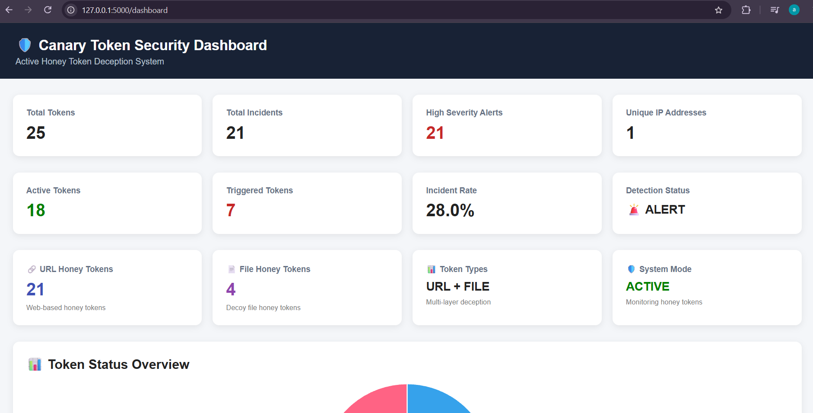
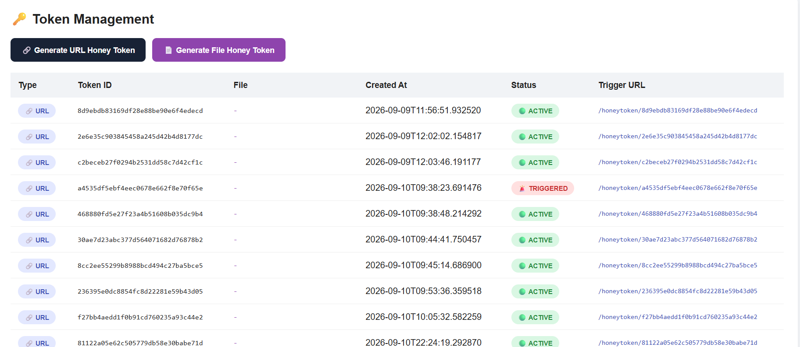
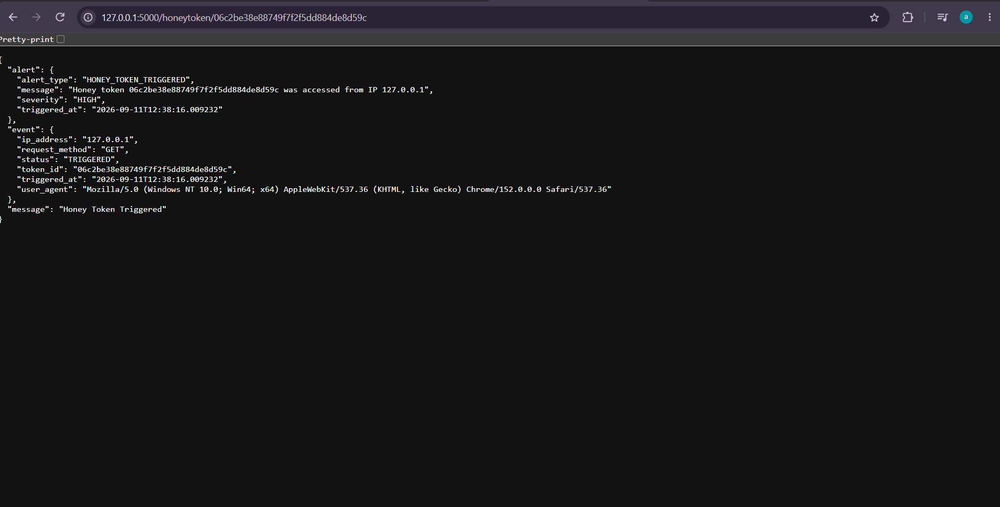
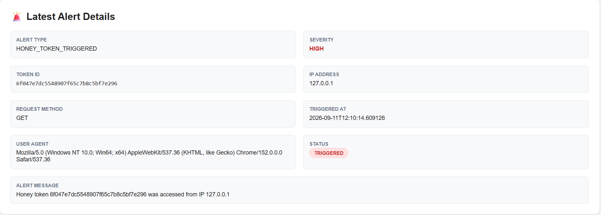
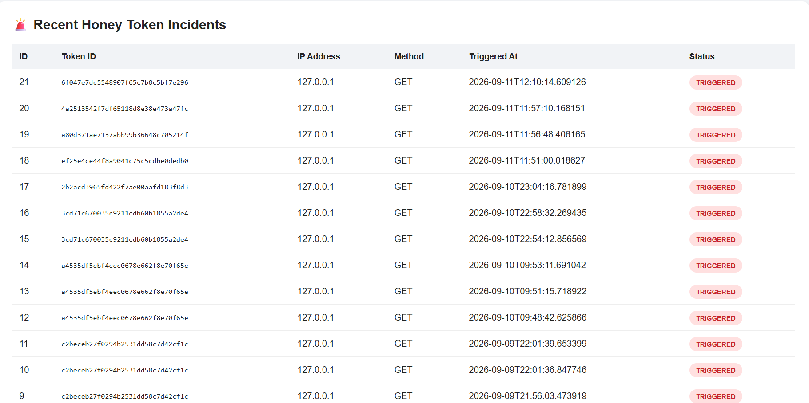

# Canary Token Active Honey Token Deception System

A Flask-based cybersecurity deception and incident-monitoring system that uses **honey tokens and decoy files** to detect suspicious access attempts. When a protected token is triggered, the system records the event, captures request information, creates a security alert, and updates the administrator dashboard.

> **Academic / PBL Project:** This project demonstrates deception-based detection for learning, controlled demonstrations, and cybersecurity project work. It is not a production-ready security platform.

## Key Features

- 🔐 **Administrator Authentication** with hashed passwords
- 🪤 **URL Honey Tokens** with cryptographically random token IDs
- 📄 **File Honey Tokens** that create realistic decoy files
- ♻️ **Unique File Names** such as `Employee_Report.pdf`, `Employee_Report_001.pdf`, etc.
- 🚨 **Automatic Detection & HIGH Alerts** when a honey token is triggered
- 🌐 **Source IP Detection** using the client request address
- 📍 **Best-effort IP Location** for public IP addresses
- 🚫 **Application-level IP Blocking** from the admin dashboard
- 📊 **Live Security Dashboard** with automatic updates
- 👤 **Separate User Dashboard** that does not expose administrator trigger URLs
- 🗃️ **SQLite Event Logging** for incidents and blocked IPs
- 📱 **Responsive Web Interface** for laptop and phone screens
- 💻 **LAN Access** for controlled demonstrations on the same network

## Technology Stack

| Technology | Purpose |
|---|---|
| Python | Core application logic and token generation |
| Flask | Web application and API routes |
| SQLite | Security-event and blocked-IP storage |
| HTML/CSS | Responsive web interface |
| JavaScript | Live dashboard updates and actions |
| Werkzeug | Password hashing and credential verification |

## System Workflow

```text
Admin creates honeytoken
        ↓
Unique token / decoy file is generated
        ↓
User receives only the decoy resource
        ↓
Resource is opened / token endpoint is triggered
        ↓
Request IP + time + method + user-agent are captured
        ↓
Detection event is stored in SQLite
        ↓
HIGH-severity alert is generated
        ↓
Admin dashboard updates automatically
        ↓
Admin investigates and can block the source IP
```

## Project Architecture

```text
canary-token-honey-token-deception-system/
│
├── alerts/
│   └── alert_manager.py
│
├── app/
│   ├── __init__.py
│   └── app.py
│
├── database/
│   ├── __init__.py
│   ├── admin_auth.py
│   └── database.py
│
├── decoy_files/
│   └── .gitkeep
│
├── detection/
│   └── detector.py
│
├── honeytokens/
│   ├── file_honeytoken.py
│   ├── generator.py
│   └── tokens.json.example
│
├── screenshots/
│   ├── dashboard.png
│   ├── token_generation.png
│   ├── alert_trigger.png
│   ├── latest_alert_details.png
│   └── recent_token_history.png
│
├── static/
│   └── style.css
│
├── templates/
│   ├── admin_login.html
│   ├── dashboard.html
│   ├── file_accessed.html
│   └── user_dashboard.html
│
├── .gitignore
├── LICENSE
├── README.md
└── requirements.txt
```

## Installation

### 1. Clone the repository

```bash
git clone https://github.com/YOUR-USERNAME/canary-token-honey-token-deception-system.git
cd canary-token-honey-token-deception-system
```

### 2. Create and activate a virtual environment

**Windows PowerShell:**

```powershell
python -m venv venv
.\venv\Scripts\Activate.ps1
```

If PowerShell blocks activation:

```powershell
Set-ExecutionPolicy -ExecutionPolicy RemoteSigned -Scope CurrentUser
```

Then activate again:

```powershell
.\venv\Scripts\Activate.ps1
```

### 3. Install dependencies

```bash
pip install -r requirements.txt
```

### 4. Start the application

```bash
python -m app.app
```

On the first run, the terminal prints a generated administrator username and password. **Save those credentials and change the password from the Admin Dashboard.**

For a controlled demo, the initial credentials can also be supplied before the first run.

**PowerShell:**

```powershell
$env:CANARY_ADMIN_USERNAME="admin"
$env:CANARY_ADMIN_PASSWORD="YourStrongPasswordHere"
python -m app.app
```

A random development Flask secret is used when `CANARY_SECRET_KEY` is not supplied. For longer-lived deployments, provide your own secret through an environment variable.

## Access the Application

After starting Flask, the terminal displays the local and LAN addresses.

### Administrator

```text
http://127.0.0.1:5000/admin/login
```

### User Dashboard

```text
http://127.0.0.1:5000/user-dashboard
```

### Health Check

```text
http://127.0.0.1:5000/health
```

For phone testing, connect the phone and laptop to the same Wi-Fi network and open the **LAN address printed in the terminal**, followed by `:5000`.

## Demonstration Workflow

1. Open **Admin Login**.
2. Sign in using the first-run credentials shown in the terminal.
3. Open the **Admin Security Dashboard**.
4. Create a file honeytoken, for example `Employee_Salary_Report.pdf`.
5. Create another file with the same name to demonstrate automatic unique naming (`_001`, `_002`, etc.).
6. Open **User Dashboard** in another browser tab/window.
7. The user sees the decoy files without seeing the administrator-only trigger endpoint.
8. Open a decoy file through the User Dashboard.
9. The system records the trigger and generates a HIGH-severity incident.
10. Return to the Admin Dashboard. The incident appears automatically without manually refreshing the page.
11. Review the source IP and location information.
12. Use **Block IP** to demonstrate application-level incident response.
13. Try the resource again from the blocked address to demonstrate the response behavior.

## Security Data Handling

Runtime data is intentionally excluded from Git tracking:

- `database/admin_config.json` — local administrator credential configuration
- `database/events.db` — local SQLite security events
- `honeytokens/tokens.json` — generated token records
- `decoy_files/*` — generated decoy resources
- `.env` / `.env.*` — local environment configuration

Do **not** commit real passwords, API keys, private credentials, or sensitive organizational data.

## Important Security Notes

- IP blocking in this project is **application-level blocking**, not an operating-system firewall rule.
- IP geolocation is best-effort and may be unavailable for private/local IP addresses or when the external lookup service cannot be reached.
- Flask's built-in server is intended for development and demonstrations, not production deployment.
- The project should be reviewed and hardened before any real-world deployment.
- Only deploy and test deception resources in systems and networks where you have authorization.

## Screenshots

### Security Dashboard



### Honey Token Generation



### Alert Trigger



### Latest Alert Details



### Recent Token History



## Future Enhancements

- Email / messaging notifications
- Role-based access control
- More honeytoken formats
- Advanced incident timeline and investigation views
- Exportable security reports
- Automated unit and integration tests
- Production WSGI deployment configuration
- Centralized logging and SIEM integration

## License

This project is licensed under the MIT License. See [LICENSE](LICENSE) for details.
